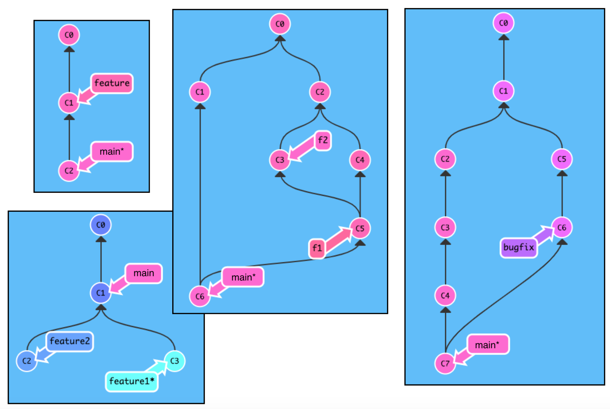

# Git Branching

Note, many git-related tools and resources are switching from "master"
to "main" for the default branch name
(https://sfconservancy.org/news/2020/jun/23/gitbranchname/).  The
default version of git on Linux 18.04 LTS uses the old name, so that's
what you'll see in the coding demos this semester.  Your project 1
will use the new naming, as well as the simulator for the exercises:
https://tyler.caraza-harter.com/cs320/s21/learnGitBranching/index.html.
In general, older git resources with the previous naming will still be
applicable if you just replace "master" with "main".

## 1. Git Simulator

### Watch: [12-minute video](https://youtu.be/ZgNdn8Gwsv0)

### Practice

Choose at least two scenarios below, then, see if you can reproduce
the situation in the git simulator:
https://tyler.caraza-harter.com/cs320/s21/learnGitBranching/index.html.

Don't worry about the colors of the commits (those are random and just
make it look nice).



## 2. A Conflict

### Watch: [22-minute video](https://youtu.be/q4m_fAuUq3A)

## 3. Runing Programs and Measuring Time

### Watch: [14-minute video](https://youtu.be/c8YKCu-qU3w)

### Practice: Timing pwd

Adapt+combine the following two examples to measure the average time it takes to run the `pwd` command:

Example 1:

```python
import time

L = list(range(1000000))
sample_size = 100

t0 = time.time()
for i in range(sample_size):
    -100 in L
t1 = time.time()
print((t1-t0)/sample_size*1e3, "milliseconds")
```

Example 2:

```python
from subprocess import check_output
check_output("pwd")
```
