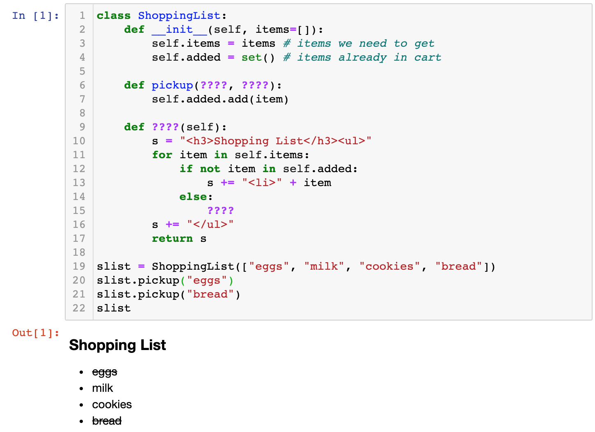

# Special Methods

## Review

**Optional:** [review problems and 10-minute explanation]

If you're new to object-oriented programming and don't feel solid on
the previous material yet, I recommend you watch the above before
proceeding.

## 1. String Representations

### Watch: [20-minute video](https://youtu.be/T18DClAvpbc)

Complete the following  code in a cell:

```python
class ShoppingList:
    def __init__(self, items=[]):
        self.items = items # items we need to get
        self.added = set() # items already in cart
    
    def pickup(????, ????):
        self.added.add(item)
    
    def ????(self):
        s = "<h3>Shopping List</h3><ul>"
        for item in self.items:
            if not item in self.added:
                s += "<li>" + item
            else:
                ????
        s += "</ul>"
        return s
    
slist = ShoppingList(["eggs", "milk", "cookies", "bread"])
slist.pickup("eggs")
slist.pickup("bread")
slist
```

The goal is see a bulleted list with some items crossed off, like this:



Hint: the HTML for something crossed off is like this: `<del>crossed-out text</del>`

## 2. \_\_getitem\_\_

### Watch: [21-minute video](https://youtu.be/bxfdj5FIsis)
