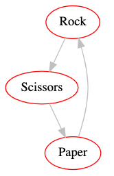

# Graphs and Trees Intro

## 1. Introduction to Graphs

### Setup

To follow these following lecture examples for yourself, you'll need
graphviz (https://www.graphviz.org/) installed on your VM.  The
graphviz program is called `dot`.  SSH to your VM and try running it:

```
trh@instance-1:~$ dot -V

Command 'dot' not found, but can be installed with:

apt install graphviz
Please ask your administrator.
```

We don't have it, but Ubuntu is helpfully telling us how to install it (with `apt ...`)!  We'll take their suggestion, but use `sudo` so we can install as root (the name for the admin user):

```
sudo apt install graphviz
```

Let's try again and confirm that we can see the installed version:

```
trh@instance-1:~$ dot -V
dot - graphviz version 2.40.1 (20161225.0304)
```

Great!  You'll also need to install the graphviz package for Python so that we can write code to generate graphs (instead of creating them manually).

```
pip3 install graphviz
```

### Watch: [14-minute video](https://youtu.be/PcxqKpWxdBU)

## 2. Paths

### Watch: [14-minute video](https://youtu.be/b2pFvYaCEkI)

### Practice:

Use graphviz to create a graph that looks like this:



## 3. Trees

### Watch: [17-minute video](https://youtu.be/ya1BqhvP_vU)
