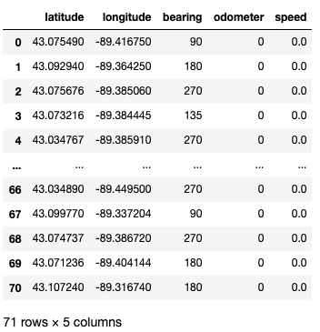
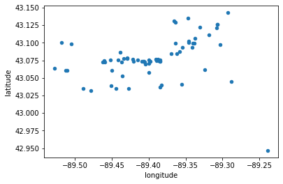
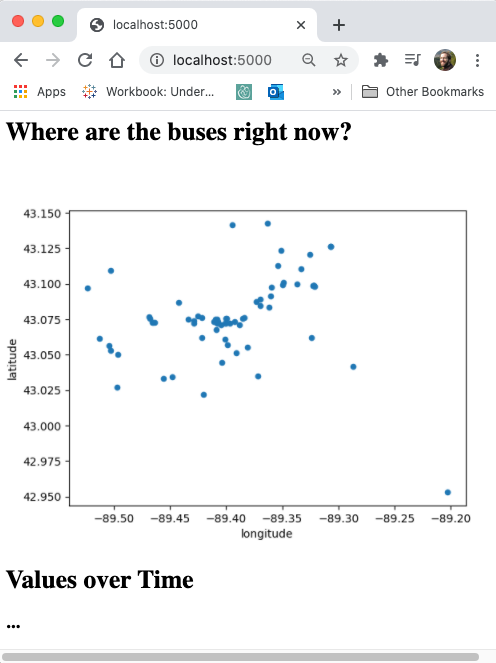

# Dashboards

## 1. Dashboards (Part 1)

### Watch: [15-minute video](https://youtu.be/fpvmm-Q_o-g)

## 2. CDFs (Part 2)

### Watch: [12-minute video](https://youtu.be/AmemhJVHpOw)

## 3. Dashboard Improvements (Part 3)

### Watch: [19-minute video](https://youtu.be/yHbATWIwFE8)

### Practice: Add a Dashboard Plot

This json page shows the current location of all buses in Madison (it
is updated every minute or so):
http://transitdata.cityofmadison.com/Vehicle/VehiclePositions.json

Here is a code snippet to pull all those locations into a DataFrame:

```python
import pandas as pd
import requests

r = requests.get("http://transitdata.cityofmadison.com/Vehicle/VehiclePositions.json")
r.raise_for_status()

rows = []
for entity in r.json()["entity"]:
    rows.append(entity["vehicle"]["position"])
df = pd.DataFrame(rows)
df
```



Write a bit of code to represent each bus on a scatter plot, with
latitude on the y-axis and longitude on the x-axis.  At the time this
is written, the buses were at these locations:



Modify the example dashboard from lecture so it also contains the plot of
buses, something like this:



For your convenience, here is the code from lecture (or download it from GitHub):

```python
from flask import Flask, Response
from matplotlib import pyplot as plt
from io import BytesIO
import pandas as pd
import random

plt.switch_backend('agg')
app = Flask(__name__)
values = [1,2,5,4,8,7,3,3,4,2,3]

@app.route("/")
def home():
    values.append(random.randint(1, 10))
    
    html = """
    <html>
    <body>
    <h1>Where are the buses right now?</h1>
    

    <h1>Values over Time</h1>
    

    <h1>CDF</h1>
    

    <h1>Sorted Values</h1>
    
    </body>
    </html>
    """

    return html

@app.route("/cdf.svg")
def cdf():
    fig, ax = plt.subplots()
    s = pd.Series(sorted(values))
    rev = pd.Series(100*(s.index+1)/len(s), index=s.values)
    rev.plot.line(ax=ax)
    ax.set_xlabel("Values")
    ax.set_ylabel("Percent Less")

    buf = BytesIO()
    fig.savefig(buf)
    return Response(buf.getvalue(), headers={"Content-Type": "image/svg+xml"})

@app.route("/sorted.svg")
def sorted_values():
    fig, ax = plt.subplots()
    pd.Series(sorted(values)).plot.line(ax=ax)

    buf = BytesIO()
    fig.savefig(buf)
    return Response(buf.getvalue(), headers={"Content-Type": "image/svg+xml"})

@app.route("/val_over_time.svg")
def over_time():
    fig, ax = plt.subplots()
    pd.Series(values).plot.line(ax=ax)

    buf = BytesIO()
    fig.savefig(buf)
    return Response(buf.getvalue(), headers={"Content-Type": "image/svg+xml"})

if __name__ == '__main__':
     app.run("0.0.0.0", debug=True)
```