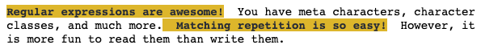

# Regular Expressions 1

## 1. Regular Expressions (Part 1)

### Watch: [15-minute video](https://youtu.be/A69wqpFzVBY)

## 2. Regex Repetition (Part 2)

### Watch: [15-minute video](https://youtu.be/1jc9AW1lSiYa)

### Practice: Exclamations!

Complete the following:

```python
import re

# from DS100 book...
def reg(regex, text):
    """
    Prints the string with the regex match highlighted.
    """
    print(re.sub(f'({regex})', r'\033[1;30;43m\1\033[m', text))
    
s = "Regular expressions are awesome!  You have meta characters, character classes, and much more.  Matching repetition is so easy!  However, it is more fun to read them than write them."
reg(????, s)
```

You should capture all the sentences that end in an explamation mark, like this:



## 3. Python re Module (Part 3)

### Watch: [12-minute video](https://youtu.be/R4eMjKtN4OU)

### Practice: Triple Pairs of Vowels

The word "mountaineer" has three pairs of vowels: "ou", "ai", and
"ee".

On Linux computers, the "/usr/share/dict/words" file usually contains
a list of English words.

Complete the following to find all the words in English that contain
at least three pairs of vowels, like "mountaineer":

```python
import re

with open("/usr/share/dict/words") as f:
    for word in f:
        word = word.strip().lower()
        matches = re.findall(????, word)
        if ???? >= 3:
            print(word)
```
