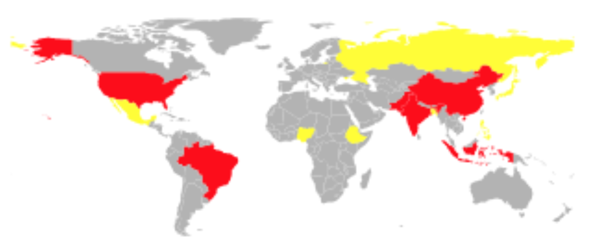
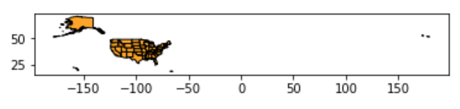
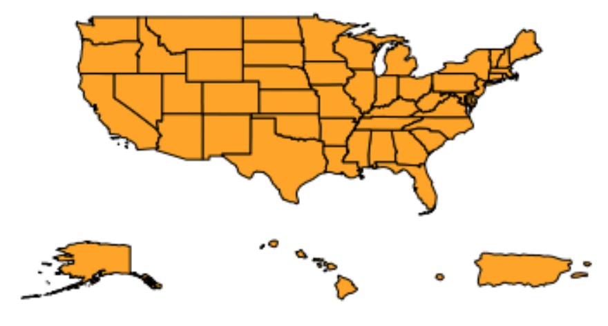
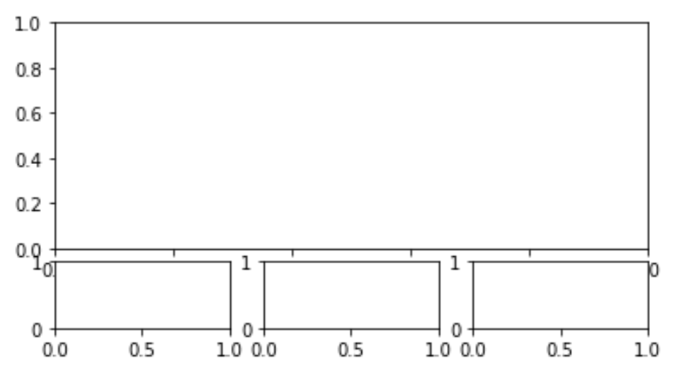

# Geographic Maps

## 1. Geopandas (Part 1)

### Watch: [26-minute video](https://youtu.be/SvCvRqMVuHg)

### Practice: Filtering and Coloring

Start with this example:

```python
world_df = geopandas.read_file(geopandas.datasets.get_path("naturalearth_lowres"))
world_df = world_df[world_df["continent"] != "Oceania"]
world_df["color"] = "0.7"
world_df.loc[world_df["pop_est"] > 2e8, "color"] = "red"
world_df.plot(color=world_df["color"])
ax.set_axis_off()
```

Modify it so that:
1. it includes Oceania, but excludes Antarctica
2. countries with >200 million are still red, but those in the 100-200 million range are yellow

It should look like this:



## 2. Shapefiles (Part 2)

### Watch: [20-minute video](https://youtu.be/Wiu7DKewjwQ)

### Practice: Map of United States

For practice, you'll download and manipulate a shapefile to create a
map of the United States.

Go to the US Census page here and use `wget` to download the zipped
shapefile named `cb_2018_us_state_20m.zip` to your VM:

https://www.census.gov/geographies/mapping-files/time-series/geo/carto-boundary-file.html

Now, create a map using this:

```python
import geopandas
us = geopandas.read_file("zip://states.zip")
us.plot(color="orange", edgecolor="k")
```



Pretty unreadable, huh?  If we draw Alaska, Hawaii, and Puerto Rico
separately from the continental US, we can get a more readable map,
like this:



First, let's split the GeoDataFrame to four parts:

```python
us.set_index("STUSPS", drop=False, inplace=True)
continent = us[~us["STUSPS"].isin(["AK", "HI", "PR"])]
ak = us.loc["AK":"AK"]
hi = us.loc["HI":"HI"]
pr = us.loc["PR":"PR"]
```

Now, copy/paste the following to a cell create four areas where we can
plot:

```python
fig = plt.figure()
gs = fig.add_gridspec(5, 3)
ax1 = fig.add_subplot(gs[:3, :])
ax2 = fig.add_subplot(gs[3, 0])
ax3 = fig.add_subplot(gs[3, 1])
ax4 = fig.add_subplot(gs[3, 2])
```



Add the following to the same cell where you pasted the last code to
draw the four groups of states:

```python
continent.plot(color="orange", edgecolor="k", ax=ax1)
ak.plot(color="orange", edgecolor="k", ax=ax2)
hi.plot(color="orange", edgecolor="k", ax=ax3)
pr.plot(color="orange", edgecolor="k", ax=ax4)
```

At this point, you'll notice two remaining problems:

1. the axes add clutter
2. Alaska wraps around to the Eastern hemisphere, making it difficult to plot

Solve both these problems by adding the following to your cell that
does the plotting:

```python
ax2.set_xlim(-180, -120)
for ax in fig.axes:
    ax.axis("off")
```
