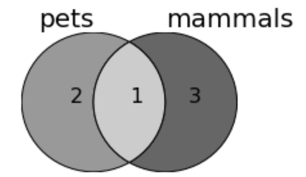

# Shapely and Animations

## 1. Shapely (Part 1)

### Watch: [25-minute video](https://youtu.be/8bTX40stVRc)

### Practice: Make a `venn` function

Complete the following function:

```python
def venn(a_label, a_set, b_label, b_set):
    pass
```

You should be able to call it like this:

```python
venn("pets", {"dogs", "snakes", "birds"}, 
     "mammals", {"dogs", "cats", "whales", "gorillas"})
```

To get a plot Venn like this:



For your convenience, here is the code from the lecture video to adapt
for your function:

```python
from shapely.geometry import Polygon, Point
from matplotlib import pyplot as plt
from descartes import PolygonPatch

a_set = {1, 2, 3}
b_set = {3, 4, 5, 6, 7, 8}

qa = len(a_set.difference(b_set))
qb = len(b_set.difference(a_set))
qab = len(a_set.intersection(b_set))
q_max = max(qa, qb, qab)

fig,ax = plt.subplots(figsize=(3,2))
ax.set_xlim(0,3)
ax.set_ylim(0,2)

c1 = Point(1, 1).buffer(1)
ax.text(1, 2, "A", size=20, va="bottom", ha="center")
c2 = Point(2, 1).buffer(1)
ax.text(2, 2, "B", size=20, va="bottom", ha="center")
A = c1.difference(c2)
B = c2.difference(c1)
AB = c1.intersection(c2)

for quantity, area in [(qa, A), (qb, B), (qab, AB)]:
    percent_of_max = quantity / q_max
    bg_color = (1-percent_of_max)*0.6 + 0.4
    ax.add_artist(PolygonPatch(area, facecolor=str(bg_color)))
    ax.text(area.centroid.x, area.centroid.y, quantity, size=16)
plt.axis("off")
```

Solution [here](venn-solution.md).

## 2. Animations (Part 2)

### Watch: [15-minute video](https://youtu.be/Rc-GwezFHn8)

### Practice: Motion

Copy/paste the following example and run it:

```python
from matplotlib import pyplot as plt
from matplotlib.animation import FuncAnimation
from IPython.core.display import HTML
from time import time

fig, ax = plt.subplots(figsize=(6,6))

circ = plt.Circle((0, 0), 0.1, facecolor="red", zorder=1)
ax.add_artist(circ)
rect = plt.Rectangle((0, 0.3), 1, 0.1, facecolor="black", zorder=2)
ax.add_artist(rect)

def draw_frame(frame_num):
    circ.center = (frame_num*0.1, 0.5)

anim = FuncAnimation(fig, draw_frame, frames=10, interval=250)
t0 = time()
html = anim.to_html5_video()
t1 = time()
print("Seconds to generate:", t1-t0)
plt.close(fig)
HTML(html)
```

Now attempt to make the following changes:
1. make the ball fall from the top to the bottom of the screen (in the x,y tuple for `circ.center`, the y portion could get smaller as we advance through the frames)
2. make the red ball appear in front of the black bar instead of behind by modifying the `zorder` of one or both shapes
3. make the animation smoother, but not longer, by (a) increasing the frames, (b) decreasing the interval between frames, (c) changing the formula for `circ.center` so that the ball moves by less that 0.1 per frame

It ought to look something like [goal.mp4](goal.mp4).

After the last change, how long did it take to generate the animation?

## 3. FPS (Frames Per Second) (Part 3)

### Watch: [8-minute video](https://youtu.be/MXWVlHcdbfY)
