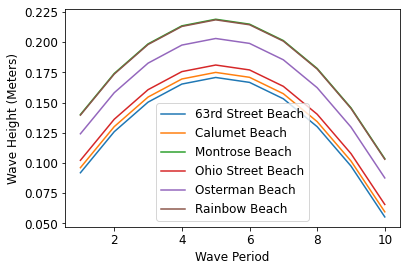

# Model Evaluation and Selection

## 1. Permutation Testing and Cross Validation

### Watch: [21-minute video](https://youtu.be/hLfAE3N5pwE)

### Practice: Train/Test Split

The pseudo-code for cross validation is something like this:
```
FUNCTION
    scores = []
    FOR fold in 0, 1, 2, 3:
        train, test = fold_split(DATA, fold=fold, fold_count=4)
        MODEL.fit(train[X], train[y])
        score = MODEL.score(test[X], test[y])
        add score to scores
    return scores
```

Complete the `fold_split` function used by the cross validation:

```python
def fold_split(data, fold, fold_count):
    fold_len = len(data) // fold_count
    test_idx1 = ????
    test_idx2 = ????
    test = data.iloc[test_idx1:test_idx2]
    train_before = data.iloc[:test_idx1]
    train_after = data.iloc[test_idx2:]
    train = pd.concat([train_before, train_after])
    return train, test
```

Then test it on this DataFrame:

```python
df = pd.DataFrame([[1,2], [3,4], [5,6], [7,8], [0,2], [3,5], [1,6], [9,9]],
                  index=list("ABCDEFGH"), columns=["X", "Y"])
df
```

Test cases:

```python
from IPython.core.display import display
print("FOLD 0")
train, test = fold_split(df, 0, 4)
display(train)
display(test)
print("FOLD 1")
train, test = fold_split(df, 1, 4)
display(train)
display(test)
print("FOLD 2")
train, test = fold_split(df, 2, 4)
display(train)
display(test)
print("FOLD 3")
train, test = fold_split(df, 3, 4)
display(train)
display(test)
```

For fold 0, A+B should be split out; for fold 1, C+D should be split
out, etc.

## 2. Pipelines

### Watch: [29-minute video](https://youtu.be/q2_Q2uucV8M)

### Practice: Visualizing Predictions

Download the data from the example:

`wget https://github.com/tylerharter/caraza-harter-com/raw/master/tyler/cs320/s21/lec/29-regression2/waves.csv -O waves.csv`

Paste and run the following (a consolidation of the parts of the demo
necessary to train and evaluate the last model):

```python
import numpy as np
import pandas as pd
import matplotlib.pyplot as plt
from sklearn.model_selection import train_test_split, cross_val_score
from sklearn.linear_model import LinearRegression
from sklearn.pipeline import Pipeline
from sklearn.preprocessing import PolynomialFeatures, OneHotEncoder
from sklearn.compose import make_column_transformer

# load and clean data
df = pd.read_csv("waves.csv")
df = df[(df["Wave Period"] > 0) & (df["Wave Height"] > 0)]
beach_names = sorted(set(df["Beach Name"]))

# train and validate our model
train_df, test_df = train_test_split(df)
m4 = Pipeline([
    ("both", make_column_transformer((OneHotEncoder(), ["Beach Name"]), 
                                     (PolynomialFeatures(degree=2, include_bias=False), ["Wave Period"]))),
    ("lr", LinearRegression())
])
scores = cross_val_score(m4, train_df[["Beach Name", "Wave Period"]], train_df["Wave Height"], cv=10)
scores.mean()
```

Complete the following to train the `m4` model on the whole training dataset, and then plot the model's predictions for a beach of your choosing:

```python
m4.????(train_df[["Beach Name", "Wave Period"]], train_df["Wave Height"])

def plot_beach(beach_name, ax=None):
    df = pd.DataFrame({
        "Beach Name": beach_name,
        "Wave Period": np.arange(1, 11, 1),
    })
    df["predicted_wave"] = m4.????(df)
    ax = df.plot.line(x="Wave Period", y="predicted_wave",
                      label=beach_name, ax=ax)
    return ax

plot_beach(????)
```

<details>
    <summary>ANSWER</summary>
    fit, predict, "Calumet Beach" (or whichever you choose)
</details>

Use your function to plot predictions for all the beaches in a single plot:

```python
ax = plot_beach(beach_names[0])
for beach in beach_names[1:]:
    plot_beach(beach, ax=ax)
ax.set_ylabel("Wave Height (Meters)")
```

It should look like this:

