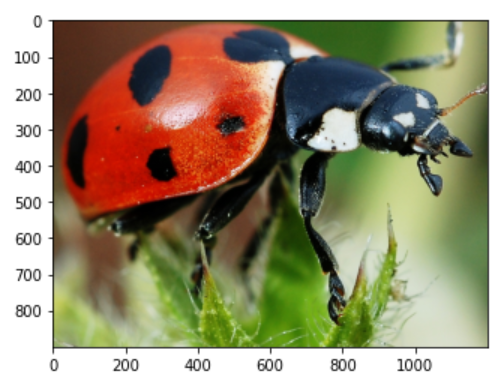
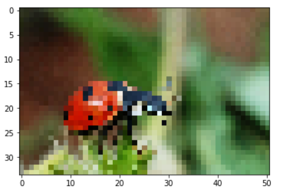
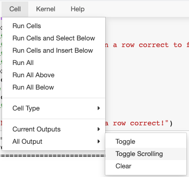

# Linear Algebra 1

## 1. Numpy

### Watch: [7-minute video](https://youtu.be/MUUik9m2hQ0)

### Practice: Slicing

Copy/paste the following to a cell:

```python
import numpy as np
a = np.arange(10)
b = a[::1]
b
```

Change the step slice above to `-1`.  What does this do to `b`?

Copy/paste the following to a cell:

```python
import numpy as np
a = np.arange(10)
half = a[:5]
# TODO
half[0] += 50
print(a[0])
```

You'll notice it prints 50, as numpy array slicing does not create a
copy like list slicing does.  Replace the TODO with a call to this
function that decouples `half` from `a`:
https://numpy.org/doc/stable/reference/generated/numpy.ndarray.copy.html.
Use the default arguments (don't pass anything in).  It should print 0
(instead of 50) after the change.

## 2. Numpy Images

### Watch: [18-minute video](https://youtu.be/4e_inNpHqx8)

### Practice: Image Manipulation

In order to use `imread`, you need to install the `Pillow` package:

```
pip3 install Pillow
```

Now download the image used during lecture (or feel free to find another one if you like):

```
wget https://upload.wikimedia.org/wikipedia/commons/f/f2/Coccinella_magnifica01.jpg -O bug.jpg
```

#### Crop

Add some numeric ranges to the following to zoom in on the bug (or the
main subject of whatever image you're using):

```python
import matplotlib.pyplot as plt
import numpy as np
a = plt.imread("bug.jpg")
a = a[:, :, :] # TODO
plt.imshow(a)
```

It should look something like this:



<details>
    <summary>ANSWER</summary>
    <code>a[700:1600, 400:1600, :]</code>
</details>

#### Resizing

What if we want to use fewer pixels to make a smaller image file?

The following uses a stride of 2 both vertically and horizontally.
Although this means we only keep 1/4 of the original pixels, the
result looks pretty much the same.

```python
a = plt.imread("bug.jpg")
a = a[::2, ::2, :]
plt.imshow(a)
```

What if you only take every 50th pixel (try it by modifying the
strides above!)?  This experiment will show you why programmers always
make fun of crime dramas on TVs where detectives keep zooming in on
images to find tiny clues. :)

<details>
    <summary>RESULT</summary>
    
</details>


#### Grayscale

Let's say we want to covert a color image to grayscale.  In the
lecture, did something like this: we pulled out red light only
(converting it to grayscale) and ignored green and blue light.

A better way is to average red, green, and blue to determine the shade
of gray.  Run the following:

```python
a = plt.imread("bug.jpg")
a = a.mean()
print(a.shape)
a
```

It's taking an average of all values in the tensor, but we only want
to average over the three colors.  Try passing `axis=N` to the `mean`
method, where `N` is 0, 1, or 2.  Which axis value gives us a
1688x2521 matrix?  Use that one, then show the image with
`plt.imshow(a, cmap="gray")`:


<details>
    <summary>ANSWER</summary>
    <code>a.mean(axis=2)</code>
</details>

## 3. Vector Multiplication

### Watch: [23-minute video](https://youtu.be/s5ZYE-1jjNU)

### Practice: Vector dot Vector

For the practices, it's probably convenient to disable output scrolling:



Run the following to practice computing the dot product yourself,
until you can get 5 in a row correct:

```python
import numpy as np

def practice():
    size = np.random.randint(1,5)
    a = np.random.randint(-3,4,size).reshape(-1,1)
    b = np.random.randint(-3,4,size).reshape(-1,1)
    print("a = ")
    print(a)
    print()
    print("b = ")
    print(b)
    print()
    answer = int(input("What is a.T@b, as a scalar?  "))
    print()
    expected = (a.T @ b)[0][0]
    if answer == expected:
        print("Good job!")
        return True
    else:
        print("\nActually, it is ", expected)
        print("Calculation:", " + ".join(f"({x}*{y})" for x,y in zip(a.reshape(-1), b.reshape(-1))))
        time.sleep(2)
        return False

goal = 5
correct = 0
while correct < goal:
    print("="*40)
    print(f"Get {goal-correct} in a row correct to finish!")
    print("="*40)
    print()
    if practice():
        correct += 1
    else:
        correct = 0
    print()
        
print(f"Nice, you got {goal} in a row correct!")
```
