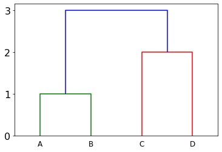
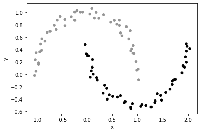

# Hierarchical Clustering

## 1. Dendrograms

### Watch: [14-minute video](https://youtu.be/kWwLSggzaKU)

### Practice: Graph Representation

Fill in the two missing heights and the one missing index of
cluster0's right child.

```python
from scipy.cluster.hierarchy import dendrogram
import numpy as np
import pandas as pd

graph = np.array([
       ["A", None, None, 0, 1],
       ["B", None, None, 0, 1],
       ["C", None, None, 0, 1],
       ["D", None, None, 0, 1],
       ["cluster1", 0, 1, ????, 3],
       ["cluster2", 2, 3, ????, 3],
       ["cluster0", 4, ????, 3, 7]])
graph = pd.DataFrame(graph, columns=["name", "left", "right", "distance", "nodes"]).fillna("")
dendrogram(graph.values[4:, 1:].astype(float), labels=graph.values[:4,0])
```

Your goal is to make a dendrogram like this:



## 2. Linkage Matrices

### Watch: [17-minute video](https://youtu.be/TTHlBqJn0QY)

## 3. Agglomerative Clustering

### Watch: [15-minute video](https://youtu.be/wF5WW9ZLJno)

### Practice: KMeans vs. AgglomerativeClustering

Paste and run the following code:

```python
from sklearn.cluster import KMeans, AgglomerativeClustering
from sklearn.datasets import make_moons
df = pd.DataFrame(make_moons(noise=0.05)[0], columns=["x", "y"])
df["color"] = KMeans(n_clusters=2).fit_predict(df[["x", "y"]])
df.plot.scatter(x="x", y="y", c=df["color"], vmin=-1)
```

KMeans is bad at clustering concave patterns; `make_moons` generates
random data to illustrate this problem.  AgglomerativeClustering can
do better, depending on the linkage option used.

First, replace `KMeans` above with `AgglomerativeClustering`, then
re-generate the plot.  Then, pass `linkage="single"` to
`AgglomerativeClustering`.  The final plot should look like this:



This page shows how different linkage options affect what clusters
AgglomerativeClustering identifies for moons and other data patterns:
https://scikit-learn.org/stable/modules/clustering.html#different-linkage-type-ward-complete-average-and-single-linkage