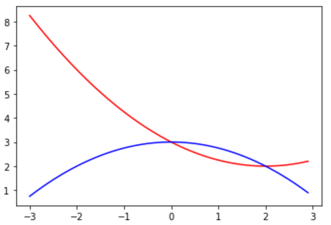
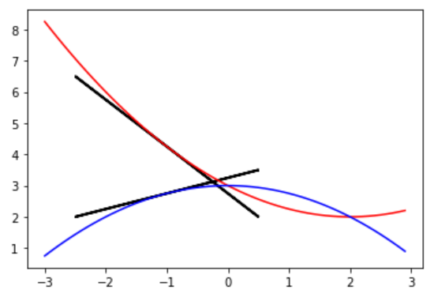

# Parallelism 2: pytorch

## 1. pytorch

### Watch: [13-minute video](https://youtu.be/JsdDxs2MUFk)

### Practice: Other Torch Operations

Many other numpy operations you've learned are also available in
PyTorch.  Try a few:

#### `.sum()`

```python
import torch
a = torch.tensor([1,2,3])
a.sum()
```

#### `.item()`, to extract the only value from a tensor

```python
a.sum().item()
```

#### `.reshape`, to make a vector vertical (or other shapes!)

```python
a.reshape(-1,1)
```

#### element-wise multiplication (and other operations)

```python
b = torch.tensor([-1, 0.5, 4])
a * b
```

## 2. Collaboratory

### Watch: [9-minute video](https://youtu.be/v1V88SgoAc4)

### Practice: Speedup

A "speedup" is how many times one option is faster than another.
Let's compute the speedup of a GPU over a CPU on collaboratory
(results will depend a lot based on what GPU and CPU you happen to get
when you do this).

Go https://colab.research.google.com/ and create a new notebook.

Under the "Runtime" menu, choose "Change Runtime Type" and choose
"GPU" under "Hardware Accelerator".

Then, run this code that multiplies two square matrices together and
prints the GPU speedup:

```python
N = 2000
A = np.random.normal(size=(N, N))
B = np.random.normal(size=(N, N))
A = torch.from_numpy(A)
B = torch.from_numpy(B)

t0 = time.time()
C = A @ B
cpu_time = time.time() - t0

assert torch.cuda.is_available() # fix your runtime if this fails!
t0 = time.time()
A = A.to("cuda")
B = B.to("cuda")
C = A @ B
cuda_time = time.time() - t0

print("The GPU has a {} times speedup over the CPU", cpu_time/cuda_time)
```

Note that a speedup of 1 means the GPU and CPU are equally fast; >1
means the GPU is faster and <1 means the CPU is faster.

Larger matrix sizes will benefit greatly from the GPU.  But for
smaller matrices, the time spent copying the data to the GPU (for
example, with `A = A.to("cuda")`) will take longer than the actual
computation, so keeping things on the CPU will actually be faster.

Try different values of `N` to try to find the break-even point, where
doing the calculation on CPU or GPU is equally fast (the speedup
should be close to 1).

The break-even point for me was about `N = 200`, but it will likely be
different for you, as Google may give you a different one of their
four GPU models.  Note that the measurements are noisy and we aren't
taking a sample, but when I use `N = 200`, speedup is sometimes
greater than 1 and sometimes less than one.

## 3. Gradients

### Watch: [12-minute video](https://youtu.be/tpA3r5-Czuk)

### Practice: Two Gradients

Paste+run:

```python
import numpy as np
import matplotlib.pyplot as plt
from torch import tensor

def plot_func(func, color="red"):
    x_vals = np.arange(-3, 3, 0.1)
    y_vals = func(x_vals)
    plt.plot(x_vals, y_vals, color)

def plot_gradient(x, y, slope):
    x, y, slope = map(float, (x, y, slope))
    dx = 3
    dy = dx*slope
    plt.arrow(x-dx/2, y-dy/2, dx, dy, linewidth=2)

def f1(x):
    y = 3 - x + (x/2)**2
    return y
    
def f2(x):
    y = 3 - (x/2) ** 2
    return y

plot_func(f1)
plot_func(f2, "blue")
```

The red line represents f1; the blue, f2.  It should look like this:



You're job is to modify the code so that it draws a tangent line for
both functions at `x=-1`.  It should look like this:



You should do so by adding and completing this snippet to the above cell:

```python
x = tensor(-1.0).????
y1 = f1(x)
y2 = f2(x)

y1.????
f1_grad = x.????
plot_gradient(x, y1, f1_grad)

x.grad.zero_()

y2.????
f2_grad = x.????
plot_gradient(x, y2, f2_grad)
```

**Hint:** each of the 5 missing pieces above should be one of the
  three following options: `requires_grad_()`, `backward()`, or
  `grad`.

As a last step, try commenting out `x.grad.zero_()` to gain intuition
about what can go wrong when that step is forgotten.
