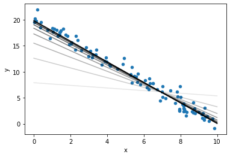

# Optimization: Gradient Descent

## 1. Manual Gradient Descent

### Watch: [15-minute video](https://youtu.be/jXiIZW69Xy0)

### Practice: Find the Best x

Paste this cell from lecture:

```python
import numpy as np
import matplotlib.pyplot as plt
from torch import tensor

plt.rcParams["font.size"] = 16

def plot_gradient(x, y, slope):
    for line in ax.get_lines():
        line.set_color("black")
        line.set_linewidth(1)
    ax.set_title("slope=%.2f" % slope)
    x, y, slope = map(float, (x, y, slope))
    dx = 0.5
    dy = dx*slope
    plt.plot([x-dx/2, x+dx/2], [y-dy/2, y+dy/2], linewidth=4, color="r")
    plt.scatter(x, y, s=100, c="k")
```

Now paste the following, and keep adding x values to try (one at a
time) until you find the minimum:

```python
def f(x):
    if x > -2:
        return (x+2.5) ** 2 - 2
    else:
        return (x+2.5) ** 4 - 2

fig,ax = plt.subplots()
ax.set_xlim(-5, 5)
ax.set_ylim(-5, 5)

def try_x(values):
    for x in values:
        x = tensor(float(x)).requires_grad_()
        y = f(x)
        y.backward()
        plot_gradient(x,y,x.grad)

try_x([0]) # TODO: add guesses to list, one at a time!
```

## 2. Gradient Descent with a Loop

### Watch: [9-minute video](https://youtu.be/-_fRFKBGrEk)

### Practice: Local Minima

Paste and run the following:

```python
def f(x):
    if x < 0:
        return ((x - -1) ** 2) * 3 - 2
    if x > 2:
        return (x - 3) ** 2
    else:
        return ((x - 1) ** 2) * 2 - 1

def try_x(x):
    x = tensor(float(x)).requires_grad_()
    y = f(x)
    y.backward()
    plot_gradient(x, y, x.grad)
    return float(x.grad)

fig,ax = plt.subplots()
ax.set_xlim(-5, 5)
ax.set_ylim(-5, 5)

x = 0 # TODO: try different starting values for x
learning_rate = 0.1

for i in range(40):
    grad = try_x(x)
    x -= grad * learning_rate
    
print(x, f(x))
```

The function has three local minima.  See if you can find each by
trying different starting values for x.

Hint: if you get stuck, plot the function like this: `ax.plot(np.arange(-5,5,0.1), [f(x) for x in np.arange(-5,5,0.1)])`

## 3. Optimizing Two Variables

### Watch: [24-minute video](https://youtu.be/4aCiz9VHvDQ)

### Practice: Visualization

Paste the example from the video:

```python
import numpy as np
import pandas as pd
import torch
from torch import tensor

x = np.random.uniform(0, 10, size=100)
noise = np.random.normal(size=x.size)
y = 20 - 2*x + noise
df = pd.DataFrame({
    "x": x,
    "ones": np.ones(x.size),
    "y": y,
})

ax = df.plot.scatter(x="x", y="y")

A = tensor(df[["x", "ones"]].values, dtype=float)
y = tensor(df[["y"]].values, dtype=float)

def mse(coef):
    y_predicted = A @ coef.reshape(-1,1)
    return ((y_predicted - y) ** 2).mean()

# coef = [slope, intercept]
coef = tensor([0.0, 0.0], dtype=float).requires_grad_()

learning_rate = 0.01
for i in range(1000):
    err = mse(coef) # mean squared error
    err.backward()
    coef.data -= coef.grad * learning_rate
    coef.grad.zero_()

coef
```

In each iteration of the training loop, the coefficients improve
slightly.  Your is to add some code to observe how the fit line
converges.

Add the following to the training loop (at the end):

```python
    if ????:
        slope = float(coef[0])
        intercept = float(????)
        x0, x1 = 0, 10
        ax.plot([x0, x1], [x0*slope+intercept, x1*slope+intercept], "k")
```

Complete the code so that:
1. a fit line is drawn every hundredth time (0th, 100th, 200th, etc)
2. the intercept is pulled from the `coef`

As a last step, add transparency so that the early lines are lighter
and the more complete lines are darker, by adding `, alpha=i/1000` to
the `.plot(...)` call.

The final thing should look like this:


