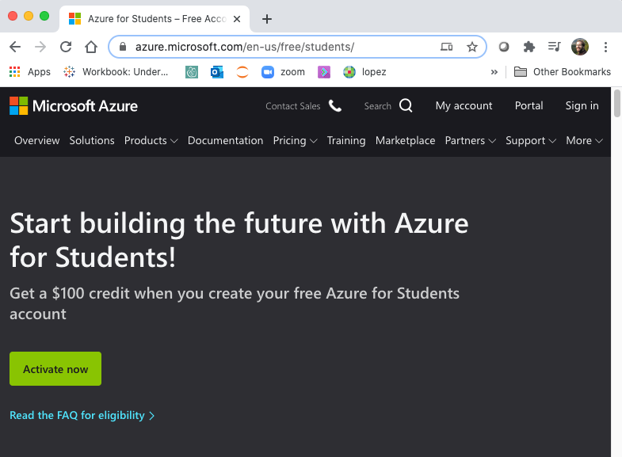
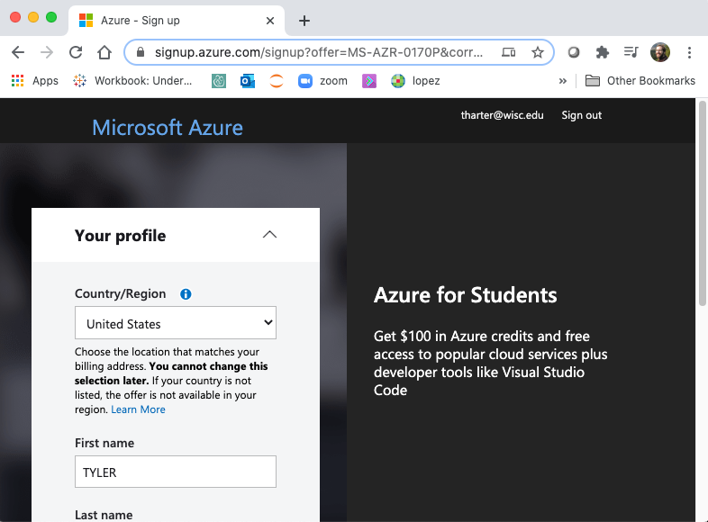
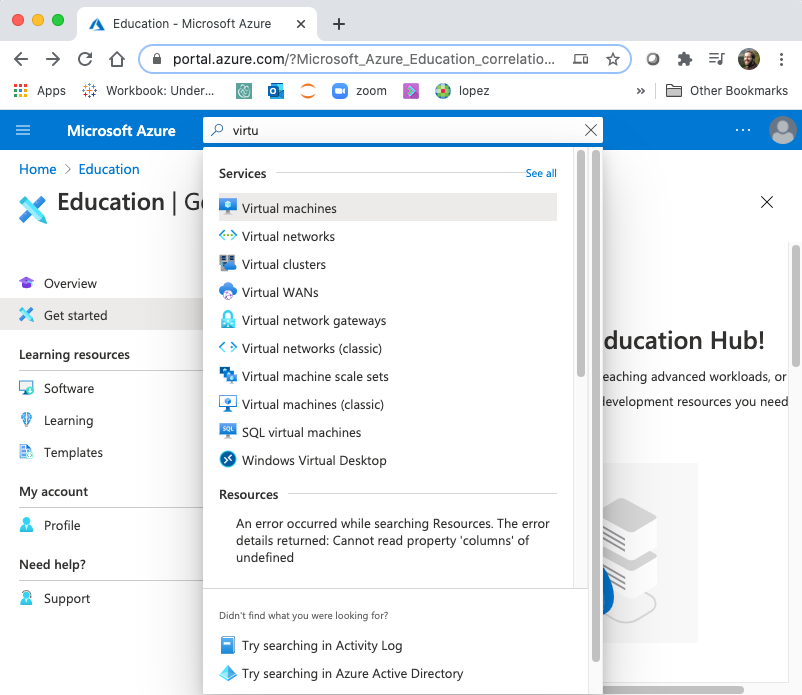
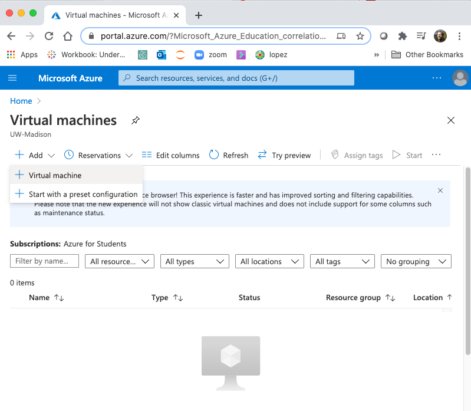
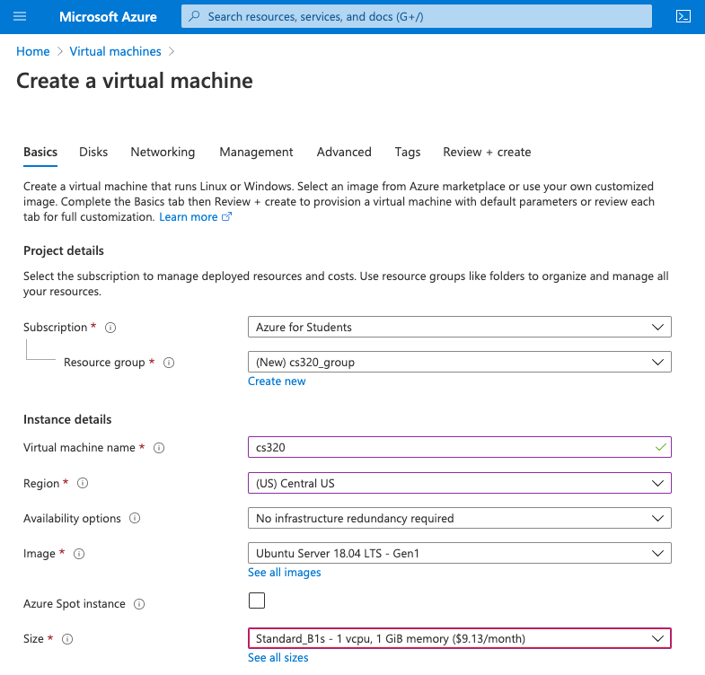
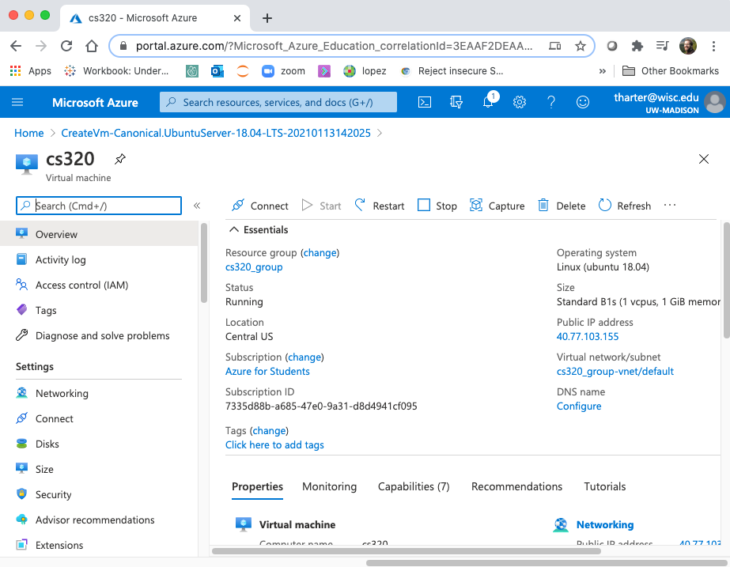
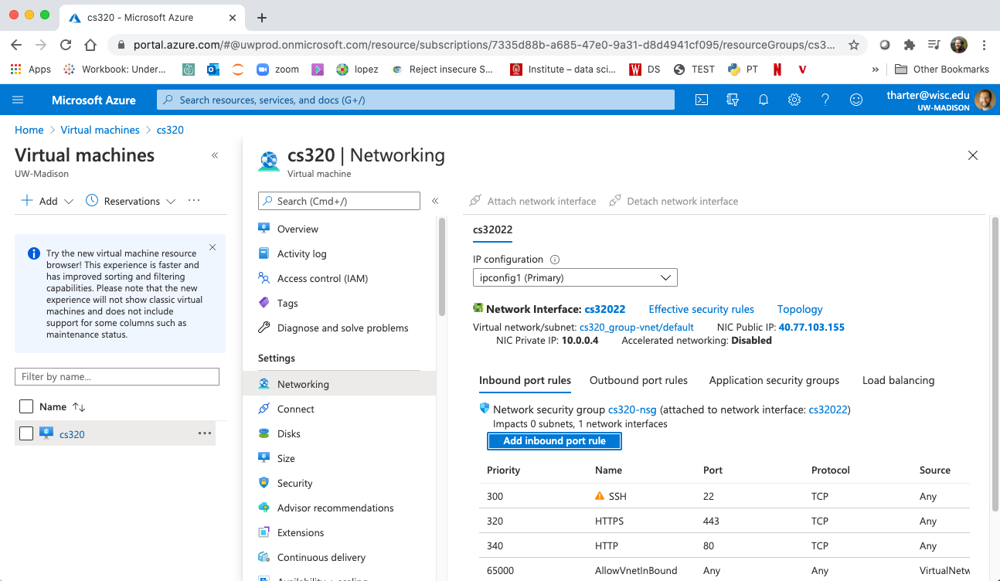
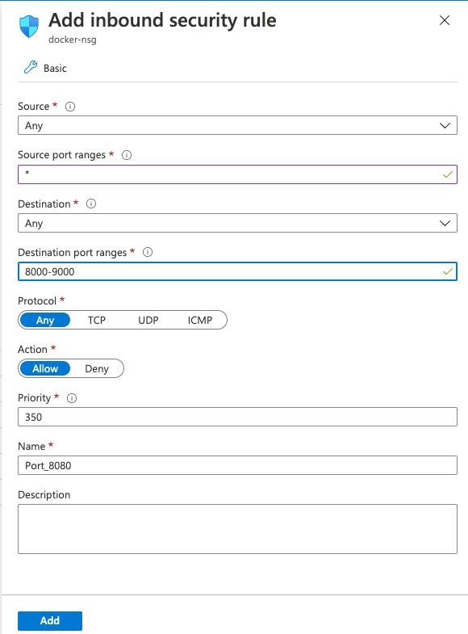
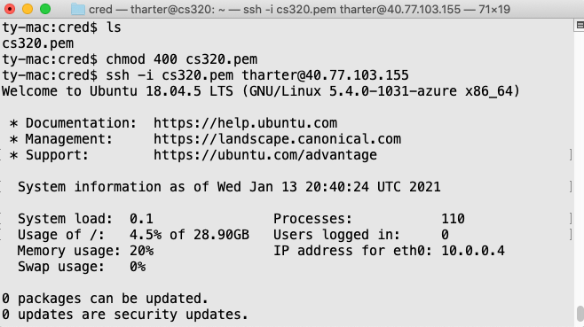
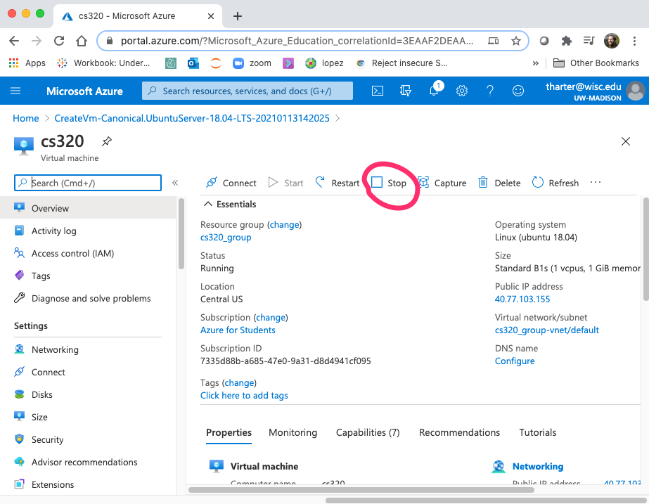

# Docker Setup

For this workshop, we'll run Docker on Linux.  To get the same setup
and make it easy to follow along, we recommend setting up a Linux
virtual machine in Azure (Microsoft's cloud).

**Note**: some of the following screenshots are adapted from my class, cs320.  If you see "cs320" anywhere, you can type "docker" instead.

Email me if you have any questions about the setup: tharter@wisc.edu.

## Corrections/Clarifications

* none yet

## Creating an Azure Account

Go here: https://azure.microsoft.com/en-us/free/students/



Click "Activate now".  Click @wisc.edu account if it shows up.
Otherwise, click "use another account" and type your @wisc.edu email.



Fill your profile details and click "Next".  Check "I agree" and "Sign up".

You can view the credits remaining on your Azure Student account at https://www.microsoftazuresponsorships.com/. 

## New Virtual Machine

Search for "Virtual machines" and click it:



Click the "+Add" button to create a new virtual machine:



Give your machine a name and choose a region near you ("Central US"
will probably be fastest for remote access for those working from
Wisconsin).  Make sure the image is "Ubuntu Server 18.04 LTS - Gen1"
(probably the default already, but double check).

**Very Important:** change the "Size" to "Standard_B1s", which costs
  <$10/month.  Larger sizes will quickly burn through any free credit
  you might have.



Other important options:

 - **Authentication type**: "SSH public key" (choose your **username**)
 - **SSH public key source**: "Generate new key pair"
 - **Key pair name**: "docker"
 - **Select inbound ports**: check all options (80, 443, 22)

**Important:** write down the **username** you chose

There are a bunch of other pages that you could get to with buttons
like "Next: Disks" and "Next: Networking".  We'll take the defaults,
so feel free to skip these with the "Review + create" button.

Click "Create", then click "Download private key and create
resource".save the .pem file somewhere safe).  Click "Go to resource".

**Important:** remember where you saved the .pem file.  Without it,
  you won't be able to access your VM later.

You'll see a page like the following:



**Important:** note down the "Public IP address" -- you'll be using it later.

## Firewall

A firewall blocks certain network activity, for security purposes.
For the workshop, we need to configure the firewall to allow certain
ports.

Click "Networking" on the page for your VM:



Click "Add inbound port rule".  The following will pop up on the right:



Add "8000-9000" to the destination port ranges.  This is the most convenient
option but not the most secure.  It's fine for a class, but not
advisable in other scenarios (e.g., if you were hosting a web
application on the VM).

## SSH

A "shell" is a program that runs in the terminal that lets you
navigate through files/directories and run programs.  "SSH" stands for
"secure shell", and it is a program that lets you remotely access
another computer (for example, your virtual machine).

For these directions, make sure you have this information handy (which
we asked to write down earlier):

1. your username
2. location of the .pem file you downloaded
3. your VM's IP address

Open the terminal (on Mac, it is called terminal; on Windows, open
PowerShell).  Use `cd` to navigate to the location where you have your
.pem file.  Run `ls` to make sure you can see the ".pem" file.

On some systems, you need to change the permissions on the .pem file
before you can use it.  Try running `chmod 400 docker_key.pem` (and don't
worry too much if it doesn't work).

Now run this:
```
ssh -i docker_key.pem USERNAME@YOUR_IP_ADDRESS
```



You'll probably get a message saying "Are you sure you want to continue connecting (yes/no/[fingerprint])?" the first time.  Type "yes" and hit ENTER.

This starts an *ssh session*.  This means that any command you type
don't run on your computer.  They run on your virtual machine.  Any
software (like Docker) that you install during the ssh session will be
installed on your virtual machine, not your laptop.

## Docker

The first thing you should do is install the latest updates on your
virtual machine, using `apt` (a program for installing other
programs):

```
sudo apt update
sudo apt upgrade
```

Type "y" if asked any questions.

Putting `sudo` in front of a command means Ubuntu should "do" the
command as the "super user" (the admin).  Only the admin can install
updates and install software.

Now we'll install docker using `snap` (like `apt`, this is a program
for installing other software).

```
sudo snap install docker
sudo chown $USER /var/run/docker.sock
```

If the following works, you're all ready for the workshop!

```
docker run hello-world
```

You should see something like this:

```
Hello from Docker!
This message shows that your installation appears to be working correctly.

...
```

## Stopping your VM (after the workshop)

Once done with your VM, you may want to stop it to release resources
and ensure you aren't billed.  You can do so via the dashboard:

